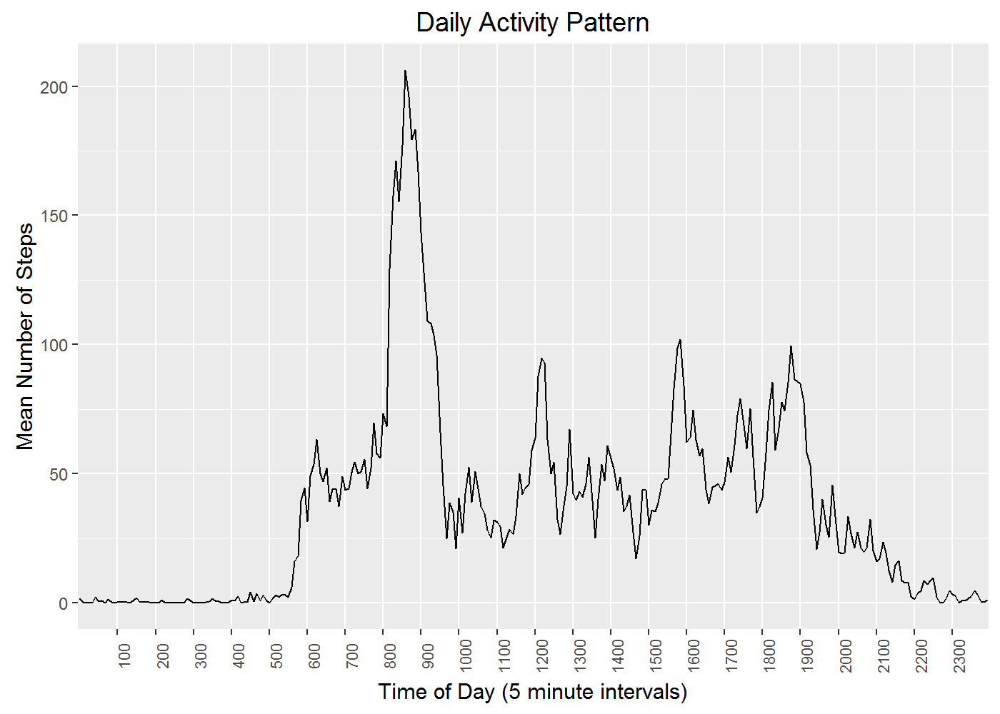

# Reproducible Research: Peer Assessment 1


## Loading and preprocessing the data


```r
# load libraries used
library("ggplot2")
```

```
## Warning: package 'ggplot2' was built under R version 3.2.3
```

```r
library("gridExtra")
```

```
## Warning: package 'gridExtra' was built under R version 3.2.3
```

```r
# Read in the dataset
rawsteps <- read.csv('activity.csv')
```


## What is mean total number of steps taken per day?


```r
# Ignore rows with no step count for now
steps <- rawsteps[!is.na(rawsteps$steps),]

# Calculate total steps for each day
stepsadaysum <- tapply(steps$steps,INDEX=as.factor(steps$date),FUN=sum)

# display a histogram of total steps per day
# (count of days for each range of steps)
qplot( stepsadaysum,bins=9,na.rm=TRUE,geom="histogram",
      main="Steps a Day Frequency",
      xlab="Steps a day",
      ylab="Number of Days"
   )
```


```r
# print the mean number of steps a day
stepsadaymean <- mean(stepsadaysum,na.rm=TRUE)
print(paste("Mean steps per day:",stepsadaymean))
```

```
## [1] "Mean steps per day: 10766.1886792453"
```

```r
# print the median number of steps a day
stepsadaymedian <- median(stepsadaysum,na.rm=TRUE)
print(paste("Median steps per day:",stepsadaymedian))
```

```
## [1] "Median steps per day: 10765"
```


## What is the average daily activity pattern?


```r
# determine the mean number of steps for each time period
stepsaperiodmean <- tapply(steps$steps,INDEX=as.factor(steps$interval),FUN=mean)

# determine the median number of steps for each time period
stepsaperiodmedian <- tapply(steps$steps,INDEX=as.factor(steps$interval),FUN=median)

# draw line graph of the mean number of steps for each time interval in a day
qplot(y=stepsaperiodmean,x=1:length(stepsaperiodmean),geom="line",
      main="Daily Activity Pattern",
      xlab="Time of Day (5 minute intervals)",
      ylab="Mean Number of Steps"
      )+
    scale_x_discrete(labels=rownames(stepsaperiodmean)[seq(13,288,by=12)],breaks=seq(13,288,by=12)) + 
    theme(axis.text.x = element_text(angle=90,size=8))
```



```r
# which 5 minute interval has the most steps on average?
max(stepsaperiodmean)
```

```
## [1] 206.1698
```

```r
which(stepsaperiodmean == max(stepsaperiodmean))
```

```
## 835 
## 104
```

```r
# (8:35am earlier than I expected)
```

## Imputing missing values


```r
# How many rows are missing values?
numna <- sum(is.na(rawsteps))
print(paste("Number of NA entries in raw data:",numna))
```

```
## [1] "Number of NA entries in raw data: 2304"
```

```r
# make a copy of the dataset and
# Set each NA value to the average (mean/median) value for the
# interval that it is in
impsteps <- rawsteps

impsteps[is.na(impsteps),]$steps <- 
stepsaperiodmean[as.character(impsteps$interval[is.na(impsteps)])]
# replace previous line with this one to use median to impute values instead 
#stepsaperiodmedian[as.character(impsteps$interval[is.na(impsteps)])]

# How many rows are missing values now?
numna <- sum(is.na(impsteps))
print(paste("Number of NA entries in imputed data (after)",numna))
```

```
## [1] "Number of NA entries in imputed data (after) 0"
```

```r
# determine the new mean number of steps for each time period
impstepsaperiodmean <- tapply(impsteps$steps,INDEX=as.factor(impsteps$interval),FUN=mean)

# draw line graph of the mean number of steps for each time interval in a day
qplot(y=impstepsaperiodmean,x=1:length(impstepsaperiodmean),geom="line",
      main="Daily Activity Pattern with Imputed Values",
      xlab="Time of Day (5 minute intervals)",
      ylab="Mean Number of Steps"
      )+
    scale_x_discrete(labels=rownames(impstepsaperiodmean)[seq(13,288,by=12)],breaks=seq(13,288,by=12)) +  
    theme(axis.text.x = element_text(angle=90,size=8))
```


```r
# Calculate new total steps for each day
impstepsadaysum <- tapply(impsteps$steps,INDEX=as.factor(impsteps$date),FUN=sum)

# print the mean number of steps a day
impstepsadaymean <- mean(impstepsadaysum,na.rm=TRUE)
print(paste("Mean imputed steps per day:",impstepsadaymean))
```

```
## [1] "Mean imputed steps per day: 10766.1886792453"
```

```r
# print the median number of steps a day
impstepsadaymedian <- median(impstepsadaysum,na.rm=TRUE)
print(paste("Median imputed steps per day:",impstepsadaymedian))
```

```
## [1] "Median imputed steps per day: 10766.1886792453"
```

Using the mean for the interval makes the graph identical
It also keeps the estimated steps/day about the same at a daily level
though the mean/day and median/day are slightly different

Using the median per interval would have more impact as 
median in this case is generally lower than mean for the same interval
since there are only steps on a few days in many intervals


## Are there differences in activity patterns between weekdays and weekends?


```r
# add an indicator for each row whether it is a weekend (Sat/Sun) or a weekday
impsteps$weekend <- factor( x=weekdays(x=as.Date(impsteps$date)) %in% c("Saturday","Sunday"),
                           levels=c(FALSE,TRUE),
                           labels=c("WEEKDAY","WEEKEND"))

# determine the new mean number of steps for each time period for WEEKEND/WEEKDAY
impstepsaperiodmean <- tapply(impsteps$steps,INDEX=list(as.factor(impsteps$interval),impsteps$weekend),FUN=mean)

# draw line graphs of the mean number of steps for each time interval weekdays vs weekends
myplot1 <- qplot(y=impstepsaperiodmean[,"WEEKDAY"],x=1:length(impstepsaperiodmean[,"WEEKDAY"]),geom="line",
      main="Daily Activity Pattern (with Imputed Values)\n\nWeekdays",
      xlab="",
      ylab="Mean Number of Steps"
         )+
    scale_x_discrete(labels=rownames(impstepsaperiodmean)[seq(13,288,by=12)],breaks=seq(13,288,by=12)) + 
    theme(axis.ticks = element_blank(), axis.text.x = element_blank())

myplot2 <- qplot(y=impstepsaperiodmean[,"WEEKEND"],x=1:length(impstepsaperiodmean[,"WEEKEND"]),geom="line",
      main="Weekends",
      xlab="Time of Day (5 minute intervals)",
      ylab="Mean Number of Steps"
         )+
    scale_x_discrete(labels=rownames(impstepsaperiodmean)[seq(13,288,by=12)],breaks=seq(13,288,by=12)) + 
    theme(axis.text.x = element_text(angle=90,size=8))

grid.arrange(myplot1, myplot2, nrow=2)
```


People appear to take more steps early on weekdays, but take more steps in the middle of the day,
and later in the evening on weekends.  This may be due to having more freedom to sleep late
and move around on weekends.

